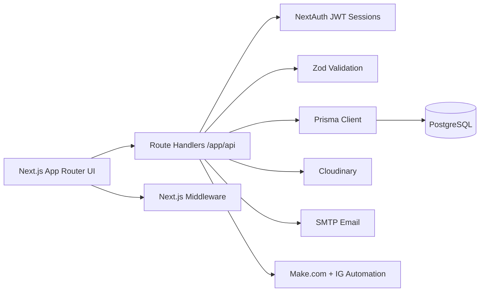

<p align="center">
  
</p>

<h1 align="center">Manchester Gents Platform</h1>

<p align="center">
  Full-stack member platform for a private social club, built to manage onboarding, event operations, consent lifecycle, and admin workflows.
</p>

<p align="center">
  <a href="https://manchestergents.com"><strong>Live Site</strong></a>
  ·
  <a href="#features">Features</a>
  ·
  <a href="#tech-stack">Tech Stack</a>
  ·
  <a href="#architecture">Architecture</a>
  ·
  <a href="#quick-start">Quick Start</a>
</p>

<p align="center">
  
  
  
  
  
  
</p>

## Overview
This project was built as a production-grade platform, not a static showcase site. It combines a polished public experience with a robust operations backend for managing members, events, and admin-led communication.

## Why This Project Is Strong For Portfolio Review
| Area | What It Demonstrates |
|---|---|
| Product Engineering | End-to-end delivery across public pages, authenticated member flows, and admin tooling |
| Backend Architecture | Route handlers, schema validation, transactional data updates, and integration orchestration |
| Security | Credentials auth, JWT sessions, role-based guards, session invalidation, reset token lifecycle |
| Data Modeling | Relational design for users, events, RSVPs, consent records, and platform settings |
| Real Integrations | Cloudinary media pipeline, SMTP email flow, Make.com webhooks, Instagram automation API |
| Deployment Readiness | Environment-aware config, Vercel target, Prisma migrations and seed strategy |

## Features
### Member Experience
- Registration with email + Instagram identity (or fallback contact flow).
- Credentials sign-in using email or Instagram handle.
- Event discovery and RSVP/cancel journey.
- Profile management for names, contact preferences, and private photo references.
- Consent management for terms and media preferences with timestamp tracking.

### Admin Experience
- Event creation and editing (content, scheduling, capacity, theme palette).
- Attendee management and RSVP operations from dedicated admin workspace.
- Member directory with consent visibility and profile editing.
- Admin-triggered RSVP reminder messaging.
- Runtime controls for site access via configurable coming-soon gate.

### Platform Features
- Password reset flow with expiring hashed tokens.
- Forced global sign-out via session version bump.
- Dynamic Open Graph image generation for main site and event pages.
- Middleware-driven routing behavior for gate enforcement and admin bypass handling.

## Tech Stack
| Layer | Technologies |
|---|---|
| Framework | Next.js 14 (App Router), React 18 |
| Language | JavaScript |
| Authentication | NextAuth (Credentials), JWT sessions |
| Validation | Zod |
| Database | PostgreSQL |
| ORM | Prisma |
| Styling | CSS Modules, global CSS variables, `next/font` |
| Media | Cloudinary (original + cropped profile variants) |
| Integrations | Nodemailer (SMTP), Make.com webhook, Instagram automation API |
| Utilities | `date-fns`, `clsx` |
| Deployment | Vercel |
| Quality Tooling | ESLint, Prisma migrations, seed scripts |

## Architecture


## Security And Reliability Highlights
- Password hashing using bcrypt before persistence.
- Input contracts enforced with Zod schemas across critical APIs.
- Role-aware authorization checks for admin-only actions.
- Session invalidation strategy (`sessionVersion`) for emergency sign-out.
- Password reset links stored as hashed tokens and marked as used once consumed.
- Forgot-password endpoint avoids account enumeration behavior.

## Quick Start
```bash
npm install
cp .env.example .env
npm run prisma:generate
npx prisma migrate dev --name init
npm run prisma:seed
npm run dev
```

Application runs at `http://localhost:3000`.

## Environment Variables
| Variable | Required | Purpose |
|---|---|---|
| `DATABASE_URL` | Yes | PostgreSQL connection string |
| `NEXTAUTH_SECRET` | Yes | JWT/session signing secret |
| `NEXTAUTH_URL` | Yes | Canonical auth URL (supports comma-separated domains in this project) |
| `CLOUDINARY_CLOUD_NAME` | Yes | Cloudinary cloud identifier |
| `CLOUDINARY_API_KEY` | Yes | Cloudinary API credential |
| `CLOUDINARY_API_SECRET` | Yes | Cloudinary API credential |
| `EMAIL_FROM`, `SMTP_*` | Optional | Required for password reset email delivery |
| `MAKE_WEBHOOK_URL` | Optional | External workflow/webhook notifications |
| `API_TOKEN`, `IG_AUTOMATION_BASE_URL` | Optional | Instagram automation integration |
| `SEED_ADMIN_*` | Optional | Override seeded admin credentials |
| `NEXT_PUBLIC_APP_URL` | Optional | Canonical URL for metadata/OG generation |

## Available Scripts
| Command | Description |
|---|---|
| `npm run dev` | Start local development server |
| `npm run build` | Build production bundle |
| `npm run start` | Run production build |
| `npm run lint` | Run ESLint checks |
| `npm run prisma:generate` | Generate Prisma client |
| `npm run prisma:migrate` | Apply Prisma deploy migrations |
| `npm run prisma:studio` | Open Prisma Studio |
| `npm run prisma:seed` | Seed admin and baseline data |

## Project Structure
```text
app/              # App Router pages, layouts, and API route handlers
components/       # Reusable UI and admin workflow components
lib/              # Auth, validation, integrations, and domain helpers
prisma/           # Prisma schema, migrations, and seed script
public/           # Static assets (logos, icons, fonts)
documentation/    # Architecture, API, data model, UX, and development docs
```

## Documentation
Technical references are maintained in [`documentation/`](./documentation):
- `overview.md`
- `architecture.md`
- `data-model.md`
- `api-reference.md`
- `auth-and-consent.md`
- `ui-ux.md`
- `development.md`

## Deployment
Target platform is Vercel.
1. Import this repository into Vercel.
2. Configure required environment variables.
3. Deploy with default Next.js build settings.
4. Apply production migrations:
```bash
npx prisma migrate deploy
```

## License
Provided as-is for portfolio and demonstration purposes.
